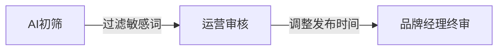

# 职场人必看：5个实战技巧玩转社交媒体自动化  

## 当手动发帖变成「体力活」  
凌晨三点还在纠结文案配什么表情包？团队因为忘记切换账号闹过笑话？某品牌曾因定时发布功能失灵，情人节祝福延迟3小时登上热搜——这些场景暴露了传统社交媒体运营的致命伤：**过度依赖人工操作，容错率低且效率天花板明显**。  

通过Reddit等平台的热门讨论可以看到，85%的运营团队在使用自动化工具后，内容发布效率提升200%以上。但真正的「工作流优化」远不止设置定时推送这么简单。

---

## 工作流优化的双重内核  
**核心概念一：流程再造**  
把「构思-创作-审核-发布-复盘」的线性流程，改造为可并行处理的模块化操作，比如将选题会产出直接导入内容模板库。  

**核心概念二：人机协作**  
自动化工具不是替代运营人员，而是帮我们腾出时间做更有价值的事。就像用咖啡机取代手工磨豆，咖啡师反而能更专注拉花艺术。  

---

## 5个立竿见影的实战技巧  

### 技巧1：选择你的「数字员工」组合包  
- **全能型选手**：Hootsuite/Buffer（适合多平台矩阵运营）  
- **视觉特化型**：Canva+Later组合（图文视频一键适配尺寸）  
- **本土作战推荐**：蚁小二/微小宝（深度支持微信/微博生态）  

💡 **避坑指南**：  
- 警惕「全平台覆盖」陷阱，先确认工具是否支持你80%的常用平台  
- 企业号务必检查API接口权限，某美妆品牌曾因工具权限不足导致日更计划流产  

### 技巧2：打造内容弹药库  
1. 建立「3×3内容矩阵」：  
   - 3种内容类型（干货/热点/品牌故事）  
   - 3种呈现形式（图文/短视频/信息图）  
   - 3种情绪基调（专业/幽默/暖心）  

2. 用Airtable或飞书多维表格搭建智能日历，自动关联素材库  

⚠️ **重要提醒**：  
每月保留20%的弹性空间给突发热点，完全依赖预设内容会让账号失去活力  

### 技巧3：设置三层审核安全阀  

- 第一层：Grammarly检查基础语法  
- 第二层：Brandwatch监测品牌关键词  
- 第三层：人工抽查文化适配度  

### 技巧4：活用数据驾驶舱  
每周重点看这3个指标：  
1. 最佳互动时段波动图（精确到15分钟段）  
2. 内容类型效能比（干货vs故事类ROI）  
3. 用户行为热力图（哪些按钮/链接被高频点击）  

🔑 **进阶玩法**：  
用Zapier把数据分析结果自动同步到团队周报，省去手动整理时间  

### 技巧5：保留人性化触点  
在以下场景关闭自动化：  
- 重大社会事件期间（需调整语气）  
- VIP用户互动（CEO账号评论优先人工回复）  
- 测试新内容形式时（前3次发布手动观察用户反应）  

---

## 自动化不是终点，而是新起点  
某母婴品牌通过自动化工具释放了40%的人力，转而组建用户社群运营小组，使客户复购率提升130%。这印证了工作流优化的真谛：**让机器处理重复劳动，让人回归创造价值**。  

最后记住这个「2小时法则」：任何自动化方案如果每周节省时间少于2小时，可能不值得投入——因为优化工具本身也需要成本。找到人机协作的甜蜜点，才是持续优化的王道。